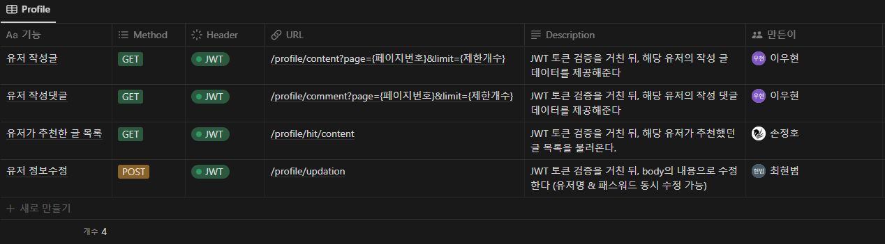

# Web Dev Guidebook 🦮

>**주제** : 웹 개발 정보 전달 커뮤니티

<pre>
평소 같은 주제의 정보들만 하더라도 수십수백 개의 게시물들이 보이게 됩니다. 이때, 사용자는 무엇이 제일 효율적이고
도움이 되는 게시글(자료)인지는 전부 읽어봐야 알고, 동영상 자료라면 전부 시청해야 알게 됩니다. 이러한 문제를 해결
하고자 나온 아이디어입니다.

즉, 사용자가 좀 더 정보 접근에 있어 시간 절약을 할 수 있게 도와주는 웹 사이트 프로젝트를 제작 중입니다.
커뮤니티 내 유저들의 외부 자료에 대한 게시글 추천제를 통하여 좀 더 빠르게 유용한 정보에 접근할 수 있도
록 구상 & 개발 중입니다.
</pre>

## 📚 Contents

- [Features](#-Features)
- [API Reference](#-API-Reference)
- [Database ERD](#-Database-ERD)
- [Execution Screens](#-Execution-Screens)
- [Module](#-Dependency-Module)
- [Summary Notes](#-Summary-Notes)

## ⚙ Features

1. JWT를 활용한 로그인, 회원가입
2. Access 토큰 이외 Refresh 토큰을 추가하여 보안 강화
3. Bcrypt 모듈을 활용하여, 더 안전하게 사용자 비밀번호 암호화
4. 기본적인 게시판 CRUD
5. 페이징 기능 & 해당 페이지에 보여줄 게시글 수 지정 가능
7. (작성자), (글 제목), (글 내용)의 종류로 게시글 검색 가능
8. 해당 게시글 추천순, 최신순 내림차순 정렬 기능
8. 해당 게시글 조회 시, 조회 수 증가 & 해당 게시글 추천 기능
9. 해당 게시글 내 댓글 작성 기능
10. 유저 프로필 내 작성 글, 댓글 & 추천한 글 목록 확인 가능
11. 유저 정보 수정 기능

## 📝 API Reference

>**AUTH**

<details>

<summary><b>VIEW APIs 👈</b></summary>


</details>

<br>

>**BOARD**

<details>

<summary><b>VIEW APIs 👈</b></summary>


</details>

<br>

>**PROFILE**

<details>

<summary><b>VIEW APIs 👈</b></summary>



</details>

## ⛓ Database ERD


## 💻 Execution Screens

>**Main**

|  |  |  |  |
| :-----------------------------------------------------------------------------------------------------------------: | :-----------------------------------------------------------------------------------------------------------------: | :-----------------------------------------------------------------------------------------------------------------: | :-----------------------------------------------------------------------------------------------------------------: |
|                                                      홈 화면 - 로그인 전                                                |                                                       홈 화면 - 로그인 후                                               |                                                      로그인                                                       |                                             회원가입                                                      |

<br>

>**Board**

|  |  |  |  |
| :-----------------------------------------------------------------------------------------------------------------: | :-----------------------------------------------------------------------------------------------------------------: | :-----------------------------------------------------------------------------------------------------------------: | :-----------------------------------------------------------------------------------------------------------------: |
|                                                      게시글 목록                                                      |                                                       게시글 생성                                                        |                                                      게시글 수정                                                       |                                                     게시글 삭제                                                      |

## 🛠 Dependency Module

```
  "dependencies": {
    "aws-sdk": "^2.1265.0",
    "bcrypt": "^5.0.1",
    "body-parser": "^1.20.0",
    "concurrently": "^7.2.2",
    "config": "^3.3.7",
    "cors": "^2.8.5",
    "express": "^4.18.1",
    "jsonwebtoken": "^8.5.1",
    "multer": "^1.4.5-lts.1",
    "multer-s3": "^2.10.0",
    "mysql": "^2.18.1",
    "mysql2": "^2.3.3",
    "nodemon": "^2.0.18",
    "sequelize": "^6.21.2",
    "sequelize-cli": "^6.4.1"
  }
```

## 📓 Summary Notes
> Click Notion icon
#### 협업 워크스페이션: [](https://goldenrod-visage-86e.notion.site/6eb6bc9baeeb4a84ad93e0eb960a0775) 👈
